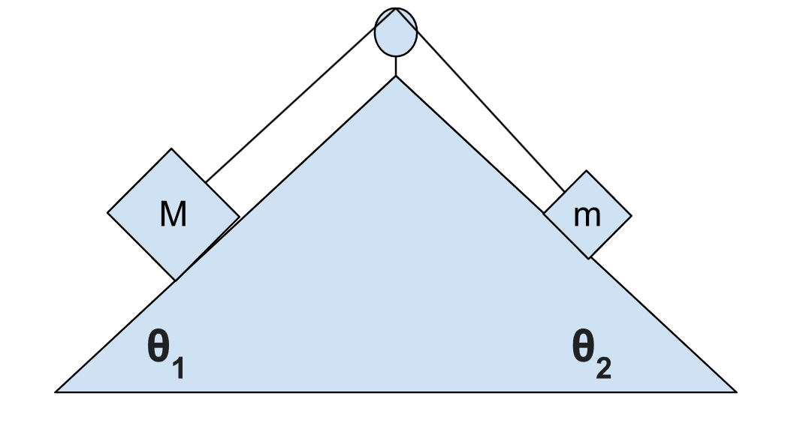
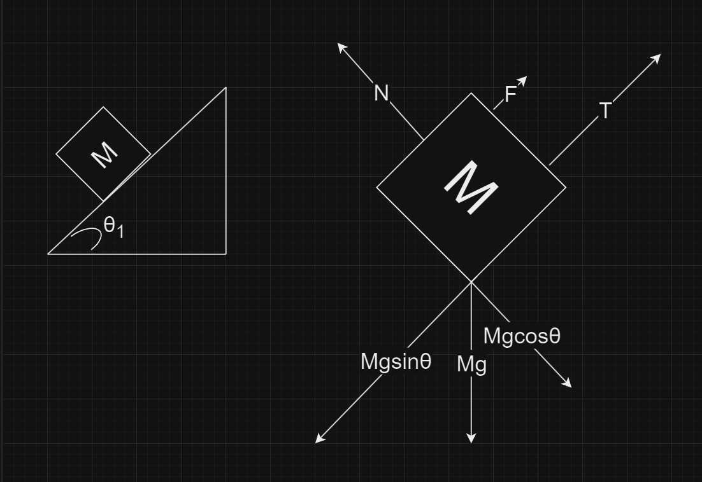
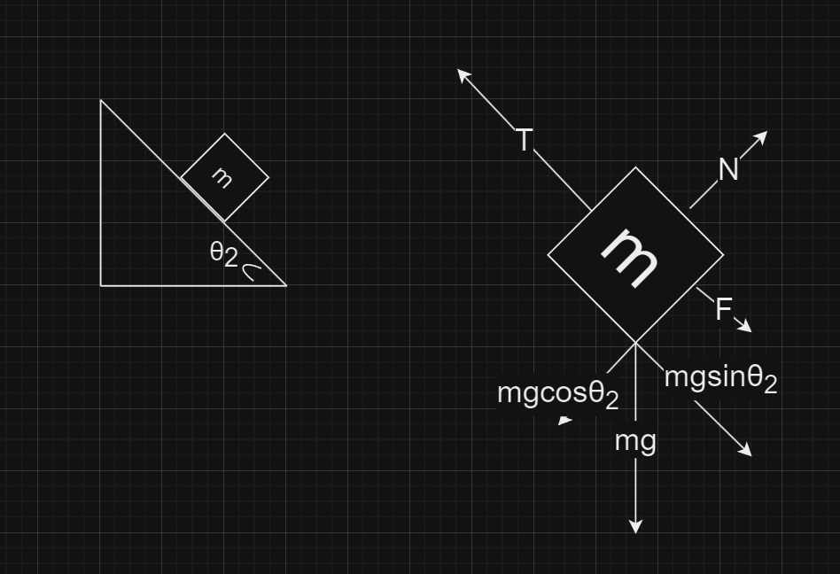

# Extra Credit - Question 3

## Part A

There are two blocks connected together by a string pulled over a frictionless, massless pulley. There is friction between the blocks and the ramp. If **M=2m**, find an equation for the coefficient of static friction as a function of **&theta;1** or **&theta;1** and **&theta;2**. Assume the force of static friction is at a maximum.

Important: Let the following always be true: 

$$\theta_{1}+\theta_{2}=90^{o}$$

Useful trigonometric identities:

$$sin(\theta-90)= -cos(\theta)$$
$$sin(\theta+90)= cos(\theta)$$
$$cos(\theta-90)= sin(\theta)$$
$$cos(\theta+90)= -sin(\theta)$$

## Part B

I have made the claim in class that when dealing with an object on a ramp, the angle the ramp makes with the horizontal is equal to the angle the force vector for the force of gravity makes in the corresponding FBD. Prove this is true using algebra and geometry.

## Answer A

Using this diagram I created I am going to explain what I did.

1. I split the problem in half so I get 2 right triangles. This allows me to separate the two different parts of the problem that can later be put together.
1. I made a Free Body Diagram labeling all of the forces acting on block `M`. This allows me to notice a few key factors.
    - Since there is no movement off of the ramp, in other words, the block is staying in contact with the ramp, we can prove with newtons second law that force **N** and the opposite force **Mgcos&theta;** are equal.
    - We can also prove that the tension force **T** is equal to **Mgsin&theta; - F** (F is the force of Friction) minus **F**.
> I would like to point out that the way I got the two forces **Mgcos&theta;** and **Mgsin&theta;** was by using triginomety. Since we are given &theta;1, we can figure out the other forces.

From this diagram, we can gather the following equations and solve for T.

$$N = Mgcos\theta$$
$$T = Mgsin\theta - F$$
$$T = Mgsin\theta - \mu_sN$$
$$T = Mgsin\theta_1 - \mu_sMgcos\theta_1$$

Now that we have the tension force for block `M`, now we can move to block `m`.

Using this diagram I created I am going to explain what I did.

1. I now made a Free Body Diagram labeling all of the forces acting on block `m`. This allows me to notice a few key factors.
    - Since the **N** force is opposite of the **mgcos&theta;2**, we can prove with Newton's second law that these are equal. We know this because there is no movement off of the ramp or in other words, block **m** is maintaining contact with the ramp.
    - Also, we can prove that force **T** is equal to **mgsin&theta;2** plus **F**, again using Newton's second law.

> I again would like to confirm that I got the forces **mgsin&theta;2** and **mgcos&theta;2** the same way as the other problem.

From this diagram, we can gather the following equations and solve for T.

$$N = mgcos\theta_2$$
$$T = mgsin\theta_2 + F$$
$$T = mgsin\theta_2 + \mu_sN$$
$$T = mgsin\theta_2 + \mu_smgcos\theta_2$$

Now that we have gathered two equations that give us two different equations that are equal to each other that both contain **&mu;s**, we can now solve for **&mu;s**.

We start by setting both equations equal to each other:

$$Mgsin\theta_1 - \mu_sMgcos\theta_1 = mgsin\theta_2 + \mu_smgcos\theta_2$$

We also know that `M = 2m`. From this we can make them both have common terms:

$$2mgsin\theta_1 - 2\mu_smgcos\theta_1 = mgsin\theta_2 + \mu_smgcos\theta_2$$

Now, we can cancel out `mg` on both sides:

$$2sin\theta_1 - 2\mu_scos\theta_1 = sin\theta_2 + \mu_scos\theta_2$$

We remember the following triginometric identities:

$$sin(\theta-90)= -cos(\theta)$$
$$sin(\theta+90)= cos(\theta)$$
$$cos(\theta-90)= sin(\theta)$$
$$cos(\theta+90)= -sin(\theta)$$

Now, we can plug this into the previous equation to gather more like terms on both sides:

$$2sin\theta_1 - 2\mu_scos\theta_1 = sin(90 - \theta_1) + \mu_scos(90 - \theta_1)$$

> We are allowed to flip the sign on the triginometric identities, that is why they look backwards.

Now, we can simply the right side of the equation since we know what these identities are equal to:

$$2sin\theta_1 - 2\mu_scos\theta_1 = cos\theta_1 + \mu_ssin\theta_1$$

We can now move **2&mu;s** to the right side of the equation to start to solve for it:

$$2sin\theta_1 -cos\theta_1 = 2\mu_scos\theta_1 + \mu_ssin\theta_1$$

We now factor a **&mu;s** out of the right side and rewrite the equation as follows:

$$2sin\theta_1 - cos\theta_1 = \mu_s(2cos\theta_1 + sin\theta_1)$$

Now, get **&mu;s** by itself:

$$\mu_s = \frac{2sin\theta_1 - cos\theta_1}{2cos\theta_1 + sin\theta_1}$$

There you have it. This is the solved value of **&mu;s** in terms of only **&theta;1**.
## Answer B